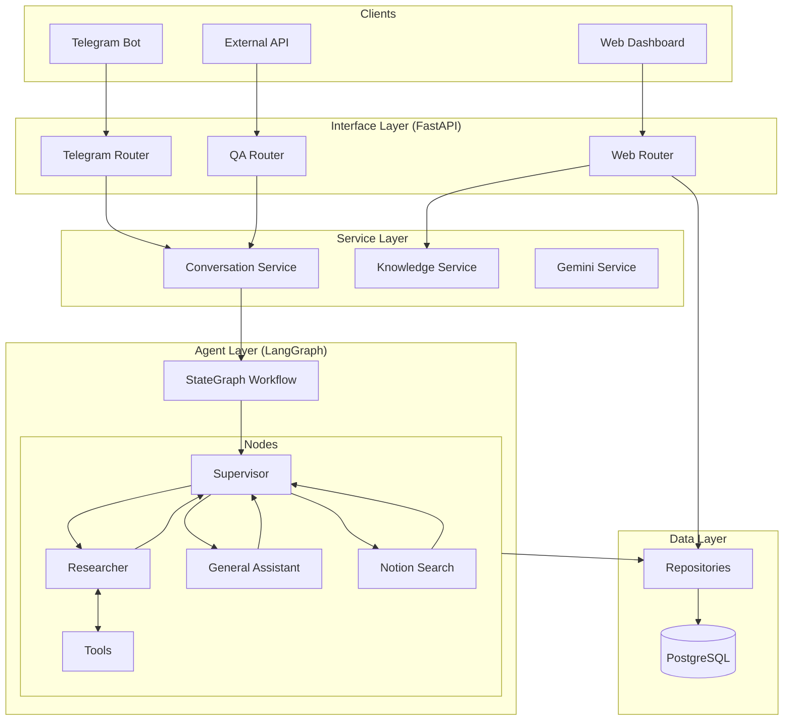
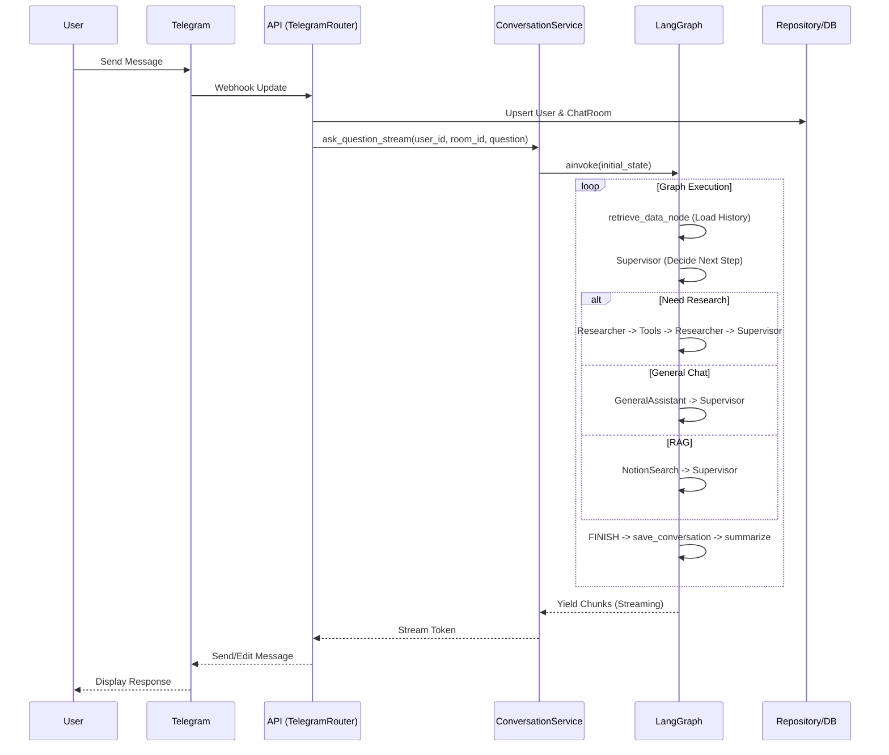
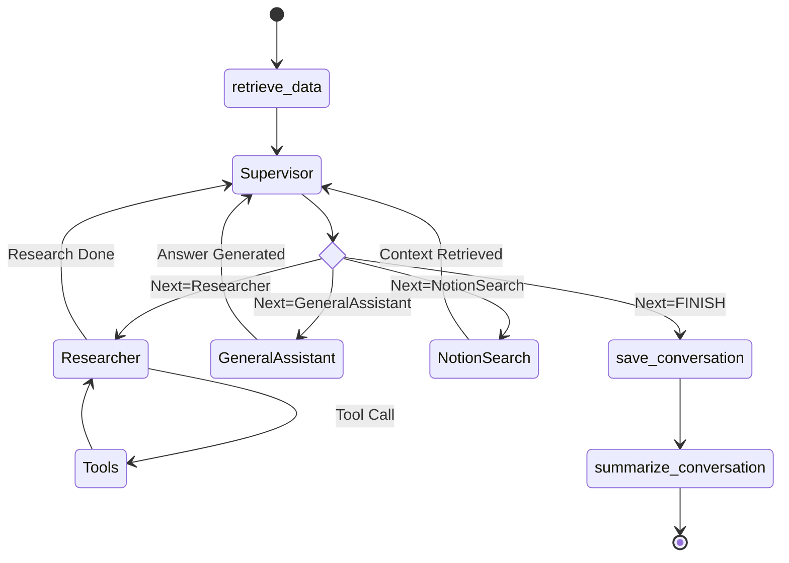

# System Architecture

## 1. High-Level Architecture Overview

The system follows a **Layered Architecture** leveraging **FastAPI** for the interface, **LangGraph** for agent orchestration, and **PostgreSQL** for persistence.

## 2. Chat Request Flow (Telegram)

Detailed flow of how a message from Telegram is processed.

## 3. LangGraph Workflow

The internal state machine of the AI agent.

