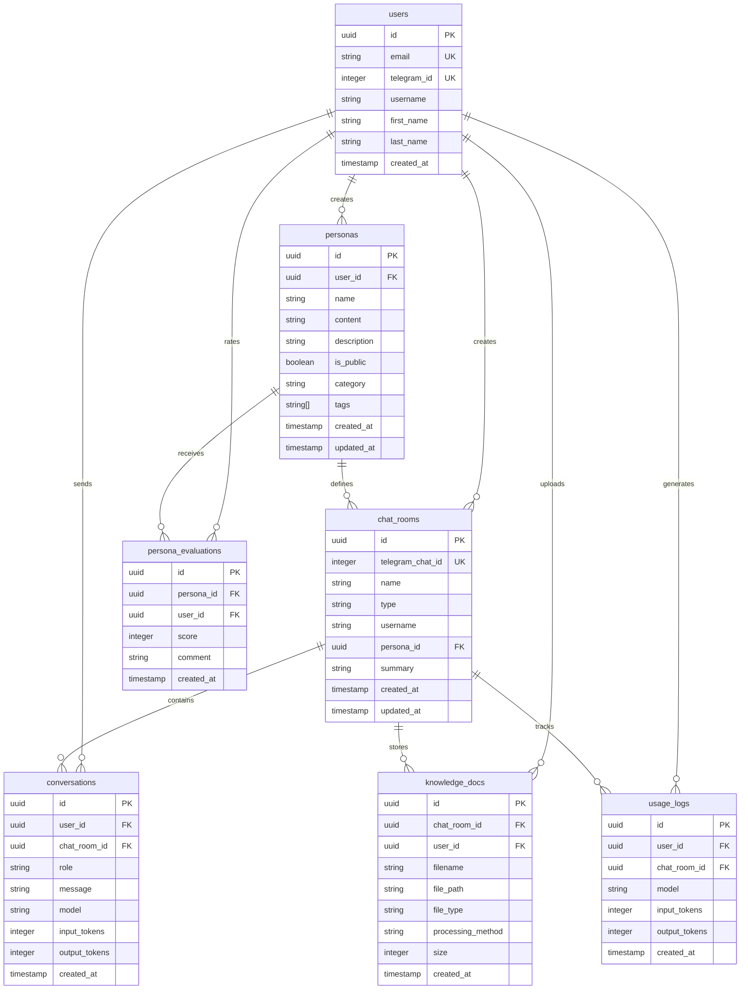

# Database Schema Documentation

## Overview

This document describes the database schema for the Chatbot AI Assistant V2 project. The database uses PostgreSQL 15+ with the pgvector extension for vector operations.

## ERD Diagram



## Table Details

### 1. users

Stores user account information including Telegram authentication data.

| Column | Type | Constraints | Description |
|--------|------|-------------|-------------|
| id | UUID | PRIMARY KEY | Unique user identifier |
| email | VARCHAR | UNIQUE, NOT NULL | User email address |
| telegram_id | INTEGER | UNIQUE | Telegram user ID |
| username | VARCHAR | | Telegram username |
| first_name | VARCHAR | | User's first name |
| last_name | VARCHAR | | User's last name |
| created_at | TIMESTAMP | NOT NULL, DEFAULT NOW() | Account creation time |

**Indexes:**
- `idx_users_email` on (email)
- `idx_users_telegram_id` on (telegram_id)

---

### 2. personas

Stores AI persona definitions that customize the chatbot's behavior.

| Column | Type | Constraints | Description |
|--------|------|-------------|-------------|
| id | UUID | PRIMARY KEY | Unique persona identifier |
| user_id | UUID | FOREIGN KEY → users(id), NOT NULL | Creator user ID |
| name | VARCHAR | NOT NULL | Persona name |
| content | VARCHAR | NOT NULL | System prompt content |
| description | VARCHAR | | Persona description |
| is_public | BOOLEAN | NOT NULL, DEFAULT FALSE | Public visibility flag |
| category | VARCHAR | | Persona category |
| tags | VARCHAR[] | | Persona tags array |
| created_at | TIMESTAMP | NOT NULL, DEFAULT NOW() | Creation time |
| updated_at | TIMESTAMP | NOT NULL, DEFAULT NOW() | Last update time |

**Indexes:**
- `idx_personas_user_id` on (user_id)
- `idx_personas_category` on (category)
- `idx_personas_tags` on (tags) using GIN

**Triggers:**
- `update_personas_updated_at`: Automatically updates `updated_at` on row update

**Relationships:**
- A persona belongs to one user (many-to-one)
- A persona can define many chat rooms (one-to-many)
- A persona can receive many evaluations (one-to-many)

---

### 3. chat_rooms

Stores chat room/conversation session information.

| Column | Type | Constraints | Description |
|--------|------|-------------|-------------|
| id | UUID | PRIMARY KEY | Unique chat room identifier |
| telegram_chat_id | INTEGER | UNIQUE, NOT NULL | Telegram chat ID |
| name | VARCHAR | | Chat room name |
| type | VARCHAR | NOT NULL | Chat room type (private, group, etc.) |
| username | VARCHAR | | Chat room username |
| persona_id | UUID | FOREIGN KEY → personas(id) | Associated persona |
| summary | VARCHAR | | Conversation summary |
| created_at | TIMESTAMP | NOT NULL, DEFAULT NOW() | Creation time |
| updated_at | TIMESTAMP | NOT NULL, DEFAULT NOW() | Last update time |

**Indexes:**
- `idx_chat_rooms_telegram_chat_id` on (telegram_chat_id)

**Triggers:**
- `update_chat_rooms_updated_at`: Automatically updates `updated_at` on row update

**Relationships:**
- A chat room is created by one user (via Telegram)
- A chat room can optionally use one persona (many-to-one)
- A chat room contains many conversations (one-to-many)
- A chat room can store many knowledge documents (one-to-many)

---

### 4. conversations

Stores individual chat messages with token tracking.

| Column | Type | Constraints | Description |
|--------|------|-------------|-------------|
| id | UUID | PRIMARY KEY | Unique conversation identifier |
| user_id | UUID | FOREIGN KEY → users(id), NOT NULL | Sender user ID |
| chat_room_id | UUID | FOREIGN KEY → chat_rooms(id), NOT NULL | Chat room ID |
| role | VARCHAR | NOT NULL | Message role (user/assistant/system) |
| message | VARCHAR | NOT NULL | Message content |
| model | VARCHAR | | LLM model used |
| input_tokens | INTEGER | DEFAULT 0 | Input token count |
| output_tokens | INTEGER | DEFAULT 0 | Output token count |
| created_at | TIMESTAMP | NOT NULL, DEFAULT NOW() | Message time |

**Indexes:**
- `idx_conversations_user_id` on (user_id)
- `idx_conversations_chat_room_id` on (chat_room_id)
- `idx_conversations_model` on (model)
- `idx_conversations_created_at` on (created_at)

**Relationships:**
- A conversation belongs to one user (many-to-one)
- A conversation belongs to one chat room (many-to-one)

---

### 5. persona_evaluations

Stores user ratings and feedback for personas.

| Column | Type | Constraints | Description |
|--------|------|-------------|-------------|
| id | UUID | PRIMARY KEY | Unique evaluation identifier |
| persona_id | UUID | FOREIGN KEY → personas(id), NOT NULL | Persona being rated |
| user_id | UUID | FOREIGN KEY → users(id), NOT NULL | Rater user ID |
| score | INTEGER | NOT NULL, CHECK(1-5) | Rating score (1-5) |
| comment | VARCHAR | | User comment |
| created_at | TIMESTAMP | NOT NULL, DEFAULT NOW() | Evaluation time |

**Indexes:**
- `idx_persona_evaluations_persona_id` on (persona_id)
- `idx_persona_evaluations_user_id` on (user_id)

**Constraints:**
- `uq_persona_user_evaluation`: UNIQUE (persona_id, user_id) - One rating per user per persona

**Relationships:**
- An evaluation belongs to one persona (many-to-one)
- An evaluation is created by one user (many-to-one)

---

### 6. knowledge_docs

Stores uploaded document metadata for RAG (Retrieval-Augmented Generation).

| Column | Type | Constraints | Description |
|--------|------|-------------|-------------|
| id | UUID | PRIMARY KEY | Unique document identifier |
| chat_room_id | UUID | FOREIGN KEY → chat_rooms(id), NOT NULL | Associated chat room |
| user_id | UUID | FOREIGN KEY → users(id) | Uploader user ID |
| filename | VARCHAR | NOT NULL | Original filename |
| file_path | VARCHAR | NOT NULL | Storage file path |
| file_type | VARCHAR | NOT NULL | File type (pdf, txt, docx) |
| processing_method | VARCHAR | DEFAULT 'text' | Processing method (text/vision) |
| size | INTEGER | | File size in bytes |
| created_at | TIMESTAMP | NOT NULL, DEFAULT NOW() | Upload time |

**Indexes:**
- `idx_knowledge_docs_chat_room_id` on (chat_room_id)

**Relationships:**
- A document belongs to one chat room (many-to-one)
- A document is uploaded by one user (many-to-one)

---

### 7. usage_logs

*(DEPRECATED)* Stores aggregate token usage statistics.

| Column | Type | Constraints | Description |
|--------|------|-------------|-------------|
| id | UUID | PRIMARY KEY | Unique log identifier |
| user_id | UUID | FOREIGN KEY → users(id), NOT NULL | User ID |
| chat_room_id | UUID | FOREIGN KEY → chat_rooms(id), NOT NULL | Chat room ID |
| model | VARCHAR | NOT NULL | LLM model used |
| input_tokens | INTEGER | NOT NULL, DEFAULT 0 | Input token count |
| output_tokens | INTEGER | NOT NULL, DEFAULT 0 | Output token count |
| created_at | TIMESTAMP | NOT NULL, DEFAULT NOW() | Log creation time |

**Indexes:**
- `idx_usage_logs_user_id` on (user_id)
- `idx_usage_logs_chat_room_id` on (chat_room_id)
- `idx_usage_logs_created_at` on (created_at)

**Note:** This table is deprecated. Token usage is now tracked in the `conversations` table directly.

---

## Vector Tables (pgvector)

### text_chunks

Stores text chunks with vector embeddings for RAG.

| Column | Type | Constraints | Description |
|--------|------|-------------|-------------|
| id | UUID | PRIMARY KEY | Unique chunk identifier |
| knowledge_doc_id | UUID | FOREIGN KEY → knowledge_docs(id) | Source document |
| chat_room_id | UUID | NOT NULL | Associated chat room |
| chunk_text | VARCHAR | NOT NULL | Chunk content |
| chunk_index | INTEGER | NOT NULL | Chunk sequence number |
| embedding | vector(768) | NOT NULL | Text embedding vector |
| token_count | INTEGER | NOT NULL | Token count |
| metadata | JSONB | | Additional metadata |
| created_at | TIMESTAMP | NOT NULL, DEFAULT NOW() | Creation time |

**Indexes:**
- Vector index on (embedding) for similarity search
- Index on (chat_room_id) for room isolation

---

## Database Functions

### update_updated_at_column()

Automatically updates the `updated_at` timestamp column.

```sql
CREATE OR REPLACE FUNCTION update_updated_at_column()
RETURNS TRIGGER AS $$
BEGIN
    NEW.updated_at = CURRENT_TIMESTAMP;
    RETURN NEW;
END;
$$ language 'plpgsql';
```

**Usage:** Attached to `personas` and `chat_rooms` tables.

---

## Migration Notes

### 2026-01-15: Personas Enhancement

Added `category` and `tags` columns to personas table for better categorization:

```sql
ALTER TABLE personas ADD COLUMN IF NOT EXISTS category VARCHAR;
ALTER TABLE personas ADD COLUMN IF NOT EXISTS tags VARCHAR[];
CREATE INDEX IF NOT EXISTS idx_personas_category ON personas(category);
CREATE INDEX IF NOT EXISTS idx_personas_tags ON personas USING GIN(tags);
```

---

## Setup Instructions

### 1. Create Database

```bash
psql -U postgres
CREATE DATABASE chatbot_db;
\c chatbot_db
```

### 2. Install Extensions

```sql
CREATE EXTENSION IF NOT EXISTS "uuid-ossp";
CREATE EXTENSION IF NOT EXISTS vector;
```

### 3. Run Schema

```bash
psql -h <host> -U <user> -d chatbot_db -f schema.sql
```

---

## Data Retention Policy

- **Conversations**: No automatic deletion
- **Knowledge Docs**: Cascade deleted when chat room is deleted
- **Personas**: Cascade deleted when user is deleted (public personas preserved)
- **Usage Logs**: No automatic deletion (table deprecated)

---

## Performance Considerations

### Index Strategy

1. **Foreign Keys**: All foreign keys are indexed for JOIN performance
2. **Query Patterns**: Indexes on frequently queried columns (user_id, chat_room_id)
3. **Vector Search**: Specialized IVFFlat index on embedding column
4. **Tags**: GIN index for efficient array operations

### Cascade Operations

- **CASCADE DELETE**: Used for maintaining data integrity
  - User deletion → cascades to conversations, personas
  - Chat room deletion → cascades to conversations, knowledge docs

### Query Optimization Tips

1. Use `EXPLAIN ANALYZE` for slow queries
2. Consider materialized views for aggregations
3. Partition conversations table by date for large datasets
4. Monitor index usage with `pg_stat_user_indexes`

---

## Backup & Recovery

### Backup

```bash
pg_dump -h <host> -U <user> -d chatbot_db -F c -f backup.dump
```

### Restore

```bash
pg_restore -h <host> -U <user> -d chatbot_db -F c -f backup.dump
```

---

*Last Updated: 2026-01-17*
