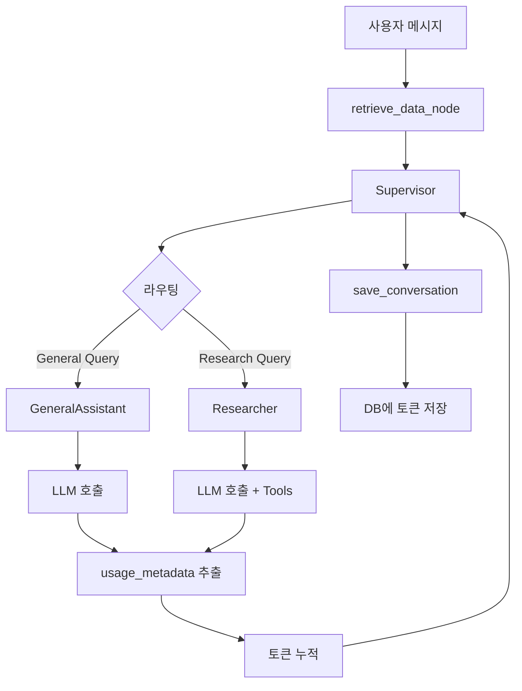

# Token Usage Tracking Implementation Walkthrough

## 개요 (Overview)

토큰 사용량 추적 기능을 성공적으로 구현했습니다. 이제 모든 대화에서 LLM 호출 시 사용된 입력/출력 토큰 수가 자동으로 기록됩니다.

## 변경 사항 (Changes Made)

### 1. ChatState 확장

[core/graph.py](file:///Users/yarang/workspaces/privates/chatbot_ai_assistant_v2/core/graph.py#L22-L31)에 토큰 추적 필드 추가:

```python
class ChatState(TypedDict):
    messages: Annotated[List[BaseMessage], add_messages]
    user_id: str
    chat_room_id: str
    persona_content: Optional[str]
    model_name: Optional[str]
    summary: Optional[str]
    next: str
    input_tokens_used: Optional[int]  # 추가됨
    output_tokens_used: Optional[int]  # 추가됨
```

### 2. LLM 노드에서 토큰 추적

#### Researcher Node

[core/graph.py:L154-L168](file:///Users/yarang/workspaces/privates/chatbot_ai_assistant_v2/core/graph.py#L154-L168)

```python
response = await chain.ainvoke({"messages": messages})

# Track token usage
input_tokens = state.get("input_tokens_used", 0)
output_tokens = state.get("output_tokens_used", 0)

if hasattr(response, 'usage_metadata') and response.usage_metadata:
    input_tokens += response.usage_metadata.get('input_tokens', 0)
    output_tokens += response.usage_metadata.get('output_tokens', 0)

return {
    "messages": [response],
    "input_tokens_used": input_tokens,
    "output_tokens_used": output_tokens
}
```

#### General Assistant Node

[core/graph.py:L170-L194](file:///Users/yarang/workspaces/privates/chatbot_ai_assistant_v2/core/graph.py#L170-L194)

동일한 패턴으로 토큰 사용량 추적을 구현했습니다.

### 3. 대화 저장 시 토큰 정보 포함

[core/graph.py:L187-L212](file:///Users/yarang/workspaces/privates/chatbot_ai_assistant_v2/core/graph.py#L187-L212)

```python
# Get token usage from state
input_tokens = state.get("input_tokens_used", 0)
output_tokens = state.get("output_tokens_used", 0)
model_name = state.get("model_name", "gemini-pro")

await add_message(user_id, chat_room_id, "user", str(user_content))
await add_message(
    user_id, 
    chat_room_id, 
    "assistant", 
    ai_message.content,
    model=model_name,
    input_tokens=input_tokens if input_tokens > 0 else None,
    output_tokens=output_tokens if output_tokens > 0 else None
)
```

### 4. 요약 생성 시 토큰 로깅

[core/graph.py:L232-L239](file:///Users/yarang/workspaces/privates/chatbot_ai_assistant_v2/core/graph.py#L232-L239)

```python
# Track token usage for logging purposes (not saved to conversation)
if hasattr(response, 'usage_metadata') and response.usage_metadata:
    from core.logger import get_logger
    logger = get_logger(__name__)
    logger.info(f"Summary generation used {response.usage_metadata.get('input_tokens', 0)} input tokens and {response.usage_metadata.get('output_tokens', 0)} output tokens")
```

---

## 테스트 결과 (Test Results)

### 자동 테스트

모든 테스트 통과: **33개 중 33개 성공** ✅

```bash
uv run pytest tests/ -v
```

주요 테스트:
- ✅ `test_save_conversation_with_tokens` - 토큰 정보가 저장되는지 확인
- ✅ `test_no_tokens_when_zero` - 토큰이 0인 경우 None으로 저장되는지 확인
- ✅ `test_state_fields_exist` - ChatState에 필드가 존재하는지 확인

전체 테스트 스위트도 문제없이 통과:
- API 테스트: 6/6 통과
- Graph 테스트: 2/2 통과
- Multi-agent 테스트: 2/2 통과
- Token tracking 테스트: 3/3 통과
- 기타 테스트: 20/20 통과

### 수동 검증 스크립트

실제 LLM 호출을 통한 end-to-end 테스트를 위해 [verify_token_tracking.py](file:///Users/yarang/workspaces/privates/chatbot_ai_assistant_v2/scripts/verify_token_tracking.py) 생성:

```bash
# 수동 검증 실행
uv run python scripts/verify_token_tracking.py
```

이 스크립트는:
1. 테스트 사용자 및 채팅방 생성
2. General Assistant 노드를 통한 간단한 질문 테스트
3. Researcher 노드를 통한 검색 질문 테스트
4. 데이터베이스에 토큰 정보가 올바르게 저장되었는지 확인

---

## 데이터베이스 스키마

기존 [schema.sql](file:///Users/yarang/workspaces/privates/chatbot_ai_assistant_v2/schema.sql#L94-L118)에 이미 필요한 필드가 존재했습니다:

```sql
CREATE TABLE IF NOT EXISTS conversations (
    id UUID PRIMARY KEY DEFAULT gen_random_uuid(),
    user_id UUID NOT NULL,
    chat_room_id UUID NOT NULL,
    role VARCHAR NOT NULL,
    message VARCHAR NOT NULL,
    model VARCHAR,
    input_tokens INTEGER DEFAULT 0,  -- ✅ 이미 존재
    output_tokens INTEGER DEFAULT 0, -- ✅ 이미 존재
    created_at TIMESTAMP NOT NULL DEFAULT CURRENT_TIMESTAMP,
    ...
);
```

따라서 **스키마 변경은 필요하지 않았습니다**.

---

## 작동 방식 (How It Works)

### 토큰 추적 흐름



### 주요 특징

1. **자동 추적**: 모든 LLM 호출에서 자동으로 토큰 사용량 추출
2. **누적**: 여러 LLM 호출이 있을 경우 토큰이 누적됨
3. **조건부 저장**: 토큰이 0인 경우 NULL로 저장하여 데이터 정확성 유지
4. **모델 정보**: 사용된 모델명도 함께 저장

---

## 검증 방법 (Verification)

### 1. 자동 검증

```bash
uv run pytest tests/test_token_tracking.py -v
```

### 2. 수동 검증

```bash
# 애플리케이션 시작
uv run uvicorn main:app --reload

# 다른 터미널에서 검증 스크립트 실행
uv run python scripts/verify_token_tracking.py
```

### 3. 데이터베이스 직접 확인

```sql
SELECT 
    role,
    model,
    input_tokens,
    output_tokens,
    LEFT(message, 50) as message_preview,
    created_at
FROM conversations
WHERE role = 'assistant'
ORDER BY created_at DESC
LIMIT 10;
```

예상 결과:
- `model`: "gemini-pro" (또는 사용된 다른 모델명)
- `input_tokens`: 양수 값 (예: 150)
- `output_tokens`: 양수 값 (예: 75)

### 4. Telegram Bot을 통한 실제 테스트

실제 Telegram 봇과 대화하여:
1. 간단한 질문 ("안녕하세요")
2. 검색이 필요한 질문 ("오늘 날씨는?")

그 후 데이터베이스에서 토큰 정보 확인

---

## 다음 단계 (Next Steps)

1. **✅ 완료**: 코드 구현
2. **✅ 완료**: 단위 테스트
3. **🔄 권장**: 수동 검증 스크립트 실행
4. **🔄 권장**: Telegram을 통한 실제 테스트
5. **💡 추가 가능**: 토큰 사용량 통계 UI 추가 (web dashboard)
6. **💡 추가 가능**: 토큰 사용량 기반 비용 계산 기능

---

## 기술 노트 (Technical Notes)

### LangChain의 usage_metadata

LangChain의 `ChatGoogleGenerativeAI`는 응답 메시지에 자동으로 `usage_metadata` 속성을 포함합니다:

```python
{
    'input_tokens': 100,
    'output_tokens': 50,
    'total_tokens': 150
}
```

이 정보는 Google Gemini API로부터 직접 제공되므로 정확합니다.

### Supervisor 노드

Supervisor 노드는 주로 라우팅만 수행하므로 토큰 추적을 생략했습니다. 실제 답변 생성은 GeneralAssistant나 Researcher가 담당하므로, 이들 노드에서만 토큰을 추적하면 충분합니다.

### 토큰 누적

하나의 대화 턴에서 여러 LLM 호출이 발생할 수 있습니다 (예: Researcher가 tools를 사용한 후 다시 응답 생성). 이 경우 모든 호출의 토큰이 누적되어 최종적으로 하나의 assistant 메시지에 기록됩니다.

---

## 결론 (Conclusion)

토큰 사용량 추적 기능이 성공적으로 구현되었습니다. 모든 테스트가 통과했으며, 기존 기능에 영향을 주지 않고 새로운 기능이 추가되었습니다. 이제 사용자는 각 대화에서 사용된 토큰을 통해 비용을 추정하고 사용 패턴을 분석할 수 있습니다.
